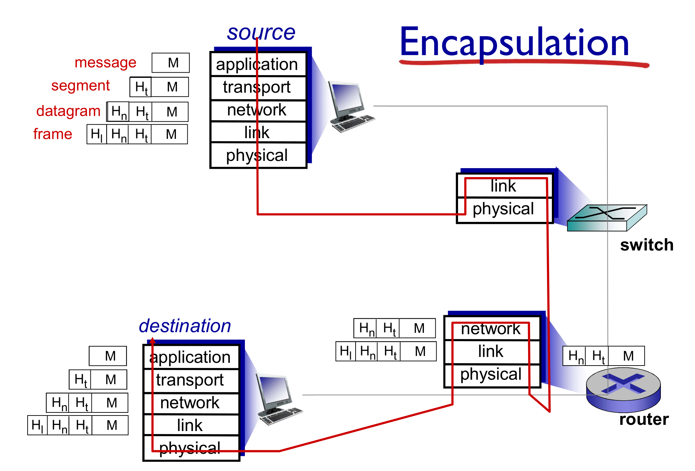
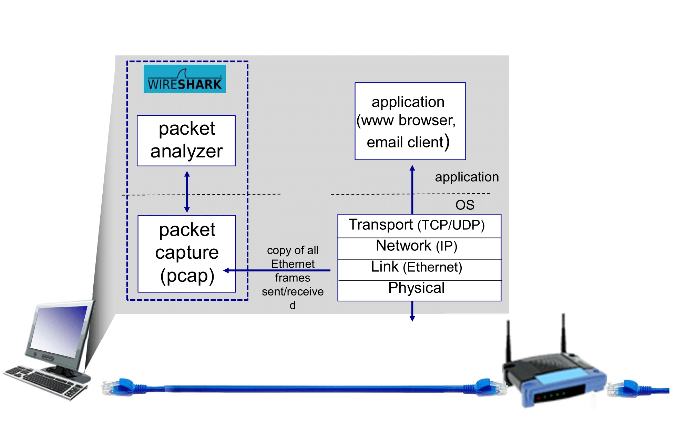

# Class 14: Computer Networking and Network Analysis

## Overview
In this lesson, we will go over the basics of computer networking. We will not have time to cover _everything_ about networks, so may have to do some searching and reading of some concepts and terms on your own time. We will perform some network analysis by dissecting some pcap files with Wireshark.

## Computer Networking
### The Internet Protocol Stack
How do computers understand each other?

---

**Application**: Supports network applications

Protocols: FTP, SMTP, HTTP

---

**Transport**: Handles process to process data transfer

Protocols: TCP, UDP

---

**Network**: Routes datagrams from source to destination

Protocols: IP

---

**Link**: Handles data transfer between neighboring network elements

Protocols: Ethernet, 802.111 (WiFi), PPP

---

**Physical**: Bits "on the wire"

---




## Wireshark
Wireshark is a network packet analyzer. It captures network packets and displays the data contained within the packets. Captured packets can be saved as pcap files and viewed with Wireshark or other packet analyzers.



>**Open up your web browser, but don't go to a website just yet. Open up Wireshark, and double-click on the 'eth0' interface to begin packet capture. Now, go to a website of your choice. What things show up in Wireshark?**


### Challenges:
* Work Smarter Not Harder
* Break In
* Country Boy
* Replay

### Challenge Help: Replay
Using openssl to get public key from private key:
```shell
openssl rsa -in private.pem -outform PEM -pubout -out public.pem
```

Some useful Python code using [Python-RSA](https://stuvel.eu/python-rsa-doc/usage.html):
```python
# you may need to run "pip install rsa"
import rsa

# Reading in .pem file and loading keys
with open('private.pem', 'rb') as f:
	privkeydata = f.read()

privkey = rsa.PrivateKey.load_pkcs1(privkeydata)

with open('public.pem', 'rb') as f:
	pubkeydata = f.read()

pubkey = rsa.PublicKey.load_pkcs1_openssl_pem(pubkeydata)
# or 'rsa.PublicKey.load_pkcs1(pubkeydata)' depending on .pem file format

# Encrypt
message = "Hello there!"
ct = rsa.encrypt(message.encode('utf8'), pubkey)

# Decrypt
pt = rsa.decrypt(ct, privkey).decode('utf8')
```

### Challenge: Paranoid
Here's a challenge from the CyBRICS CTF: [Paranoid](examples/paranoid)
>**My neighbors are always very careful about their security. For example they've just bought a new home Wi-Fi router, and instead of just leaving it open, they instantly are setting passwords!**
>**Don't they trust me? I feel offended.**
>**Can you give me their current router admin pw?**
>**Flag format is cybrics{}.**


## Other Tools
* [tshark](https://www.wireshark.org/docs/man-pages/tshark.html) - Command-line Wireshark
* [scapy](https://github.com/secdev/scapy) - Analyzing packets with Python
* [PacketTotal](https://www.packettotal.com/) - Online analysis tool
