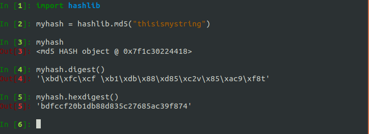
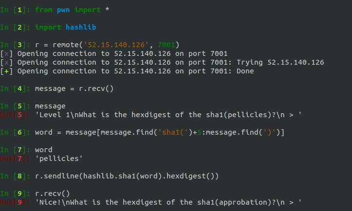

# Class 2

## Overview
The next few exercises will guide you through using cryptographic hash functions, how to reverse hashes (how to get from the hash to the original string), and how to communicate with a servers using Python. We'll also take a look at other attacks on hashes, such as forcing collisions and extending hashes. We'll be using a few new Python libraries to help us, and we'll also learn a bit about data representation (hex), and we'll build up our coding skills.


## Challenge: Intro to Hash
Take a look at the challenge **Intro to Hash**. We can see "nc 52.15.140.126 7001" in the description. This is a command that you can paste in your terminal. **nc** is short for **netcat**, which is a utility for reading from and writing to network connections. **52.15.140.126** is the IP address of the server to connect to, and **7001** is the port to connect on. The challenge is a program that is running at this IP and port.

>**Connect to the challenge by running _nc 52.15.140.126 7001_ in your terminal.**


We can see that we're being asked to give the hash of a word. What's a hash?

>**Play around for a bit with [this program](https://codepen.io/AndyNovo/pen/qqdLdG) to figure out what a hash is and to determine the properties of a hash function.**

So you can probably tell now that a hash function is a deterministic "scrambler" of some input. You pass in an arbitrary length input, and you get fixed-length output (the hash) that you cannot determine the input from. Everytime you run the same hash function on the same input, you get the same output.

Here are a few more proprties of a good hash function:
* Hash functions do not use a key. A key is a secret bit of information which let's you decrypt some encrypted message. In the case of hash functions it should be pretty much impossible to "decrypt"/"reverse" a hash.
* Crytographic hash functions should be hard to invert. That is, given h(s) but not s, it should be computationally expensive to find s.
* Hash functions should be fast to compute.
* Given an input and the hash of that input, it should be hard to compute a second message which hashes to the same value. That is, given x1,h(x1) it should be hard to compute x2 such that h(x1)==h(x2).
* It should be hard to find any two inputs that hash to the same thing.


### Generating Hashes in Python
The Python module that we're going to use for generating hashes is **hashlib**. Here's an example of using hashlib to get the **MD5** of a string:



Hashlib also has other hash functions such as SHA-1 and SHA-2 (SHA-256, SHA-512, etc.). In the example above, notice how `hashlib.md5("thisismystring")` returns a *hash object*. In order to get the actual hash value, we need to run either `myhash.digest()` or `myhash.hexdigest()`. What's the difference between the **digest** and the **hexgiest**?

The **digest** is the raw bytes of hash. If those bytes correspond to a printable character, they're represented as such, like the **t** at the end of the hash above.  If those bytes don't have a printable character, then they are represented in hex and denoted with a **\x** in front, such as **\xbd** at the beginning of the hash above. **\xbd** is one byte.

The **hexdigest** is the hex representation of the digest in ASCII values 0-9 and a-f. So **\xbd** would just be represented as **bd**, and **t** would be represented as its hex value, **74**. Most of the time we will be dealing with hex digests, which are just ASCII values, so it's important to know how to convert from the digest to the raw bytes and back. This is how you do that in Python 2.7:


>**Now, try to complete Intro to Hash**


### Automating
You've probably generated a few hashes for the challenge now and you're thinking "How many times I have to do this before it gives me the _flag_?" The answer: probably **a lot**. There's no need to fear, **pwntools** is here! With pwntools we can connect to the challenge and programmatically receive, generate the hash, and send it back. To install pwntools:
```shell
apt-get update
apt-get install python2.7 python-pip python-dev git libssl-dev libffi-dev build-essential
pip install --upgrade pip
pip install --upgrade pwntools
```
Include this at the top of your file:
```python
from pwn import *
```

This is how you can connect to the IP address and port of the challenge and interact with it using pwntools:



Now you've just got to put everything in a loop to continually receive, parse, hash, and send.
It's good to include some print statements so you can see your progress in the challenege and notice if anything fails.

>**Use pwntools to automate solving the Intro to Hash.**


### Brute Forcing


It looks like the challenge is now asking us to reverse a hash, to give the original string for a given hash. If the search space is small enough we can brute force it. The challenge is asking us to reverse the SHA-256 hash of a dictionary word. A **dictionary.txt** file was provided which we can use. 200,000 words is no problem.

To open dictionary.txt in Python:
```python
f = open('dictionary.txt', 'r')
words = [word.strip() for word in f]
f.close()
```

To brute force a single hash:
```python
for word in words:
    if hashlib.sha256(word).hexdigest() == myhash:
	print word
	break
```


Now we're being asked to reverse the MD5 hash of a random 4-letter lowercase word. We can use **itertools** to generate all the possible 4-letter words for us:

```python
from string import ascii_lowercase
import itertools

words = [''.join(c) for c in itertools.product(ascii_lowercase, repeat = 4)]
for word in words:
    if hashlib.md5(word).hexdigest() == myhash:
	print word
	break
```

>**How big is the brute force search space if I know the original string is X characters long?**

Anything past around 2<sup>22</sup> would take too long to brute force.

>**Now complete the rest of Intro to Hash using brute force.**


## Challenge: Hash Attack
Here's a new challenge to try out: *Hash Attack*.

>**Connect to the challenge by running _nc 3.220.181.160 6002_ in your terminal.**


It looks like we're being asked to give the original string for some hash, and the hash is 128 characters long (or 64 bytes, or 512 bits), indicating that this is most likely a SHA-512 hash. Other hash functions output different hash lengths. We're also given a file **dictionary.txt**. Download it.

>**This looks like another challenge we're going to have to script, so let's open that dictionary.txt file in python.**

```python
f = open('dictionary.txt', 'r')
words = [word.strip() for word in f]
f.close()
```

My guess is that they're giving us hashes of words in that dictionary. Why else would they give us that file?

>**Verify that the hash you were given is a hash of a word in the dictionary.**

Now, for every hash the challenge asks you the word for, you could loop through every word in the dictionary, hash it, and compare to the hash you were given, and repeat...

Or you could use a **dictonary attack**. You could create a Python dictionary that maps hashes of words to the orignal words. When you're given a hash, you can look it up in the dictionary and respond with the corresponding word.

>**Use a dictionary to solve Hash Attack**

```python
mydict = {}
for word in words:
    mydict[hashlib.sha512(word).hexdigest()] = word

# pseudocode
while True:
    myhash = recv()
    myguess = mydict[myhash]
    send(myguess)
```


## What Are Hashes Used For?
* Digital signatures
* Checksums
* Message Authentication Codes (MACs)
* Password storage


## Common Hash Functions
* MD5 & SHA-1 - **WEAK**
  * Vulnerable to collisions
  * Vulnerable to length extension attacks
* SHA-2
  * Vulnerable to length extension attacks
* SHA-3


## Vulnerabilities
### Collisions
Collisions happen when two different pieces of data hash to the same value.

>**Why is this bad?**

#### Challenge: Collider
>**Solve the Collider challenge.**

### Length Extension Attacks
Before we get into this attack, you should understand the concept of a Message Authenication Code, or a MAC. MACs are sort of like hashes with keys. There is a secret key that both the sender and recevier know. For some message, the sender generates a MAC using a hash function and the key. The receiver can then verify that the message is unaltered and came from the sender by generating a MAC for the received message using the same hash function and key. If the two MACs are the same, the message is verified.

Now let's look at a MAC scheme that is vulnerable to a legnth extension attack:
* MAC = H(k+m) _i.e. take the **H**ash of the **m**essage prepended with our **k**ey_

We can easily forge signatures with this scheme using programs like [HashPump](https://github.com/bwall/HashPump) or [hlextend](https://github.com/stephenbradshaw/hlextend).

#### Challenege: Extension
>**Use a length extension attack to solve the Extension challenge.**


## Tabletop
* I have a governance control which says I can only use SHA-1, which has collisions.  How can I get around this weakness?

* They are proposing to go to SHA-256. Why is this a bad idea? What if it were MD5?


## Python Modules Used
* [hashlib](https://docs.python.org/2/library/hashlib.html)
* [pwntools](https://github.com/Gallopsled/pwntools)
* [itertools](https://docs.python.org/2/library/itertools.html)


## Writeups
* [Intro to Hash](https://raw.githubusercontent.com/zelinsky/CTF-Course/master/Classes/writeups/intro_to_hash.py)


## More Challenges
* The Slash Bringing Hasher
* RockYou
* Uncomfortable Pillow
