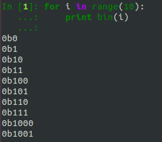

# Class 3

## Overview
The following exercises will help you undersand the binary behind all of the characters we use. You will also learn about a very important binary operation, XOR. We'll also look at an encryption scheme that uses XOR, the One-Time Pad, and we'll perform some attacks against some poorly encrypted strings.

## Binary and XOR
Everything represented on your computer is just stored as bits, 1s and 0s. Let's take a look at some binary numbers:

These are what the numbers actually are; everything else is just a lie. Even letters are just binary:

And to convert back to ASCII:

With binary operators we can just deal with the decimal representations, but it's important to understand what's happening under the hood.

Here's a truth table for the binary XOR (exclusive-or) operation:
| A | B | A XOR B |
| - | - | ------- |
| 1 | 1 | 0	  |
| 1 | 0 | 1	  |
| 0 | 1 | 1	  |
| 0 | 0 | 0	  |

And here's how to XOR two numbers in Python ('^' is the binary XOR operator in Python). Pay attenion to what is happening at the binary level:

>**Without coding it, what is 1100 ^ 0101? What about 8 ^ 11?

Now, how do we XOR two strings? Well, we just have to convert them to numbers first! We saw in the previous exercise how to do this, but there is an easier way using the pycrypto Python module. We can also convert from the number back to the bytes:

Now, you have everything you need to write your own XOR function that takes in two strings and returns the XOR of them. If you want to attempt this, it would be a great coding exercise, but I'm going to show you a quick and easy-to-use XOR function from **pwntools**:

The pwntools xor function will cycle the shorter string over the longer one.
