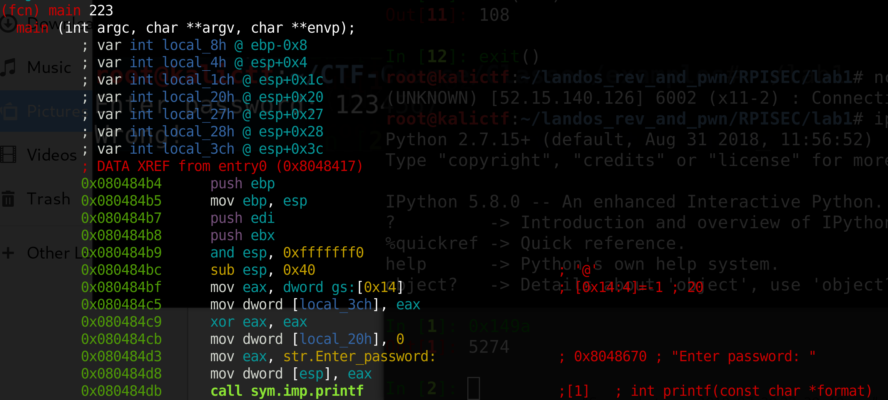

# Reverse Engineering Practice 

## Overview
In this lecture we will run through a few reversing problems and begin creating a problem solving strategy for reversing problems. 

# Lab1 
You can download the program [here](examples/lab1).

In order to make the program executable run `chmod +x lab1`. 

Before we run our program, it's a good practice to run `file` on our program to see any interesting properties of our executable. 
 

This is just a normal 32-bit ELF file that we have seen in the previous class. 

Now let's execute our program to get a basic idea of how the executable should function. 
 

This program asks for a password, which we gave `1234567`, which receives the output `Wrong`. We are looking for functionality that will evaluate our input in some password checker. 

Now let's open the executable in Radare2 with `r2 -Ad lab1`

After running `s main` and switching to Visual Mode with `Vpp`, Radare2 should look like 

In order to find the password, we are looking for how this program compares our input in some function. This initial view is just preparing the stack for local variables, and printing `Enter password: `, so we can ignore this part of the function. 

As we scroll down, we'll notice a call to scanf, which is where the program gets our input. Let's look at a few instructions before the call to scanf to find where our input is being stored. 
 

We see a call to `mov eax, 0x8048681`, and a few instructions later we see `mov dword [esp], eax`. These two instructions load the first argument to the scanf function, which is the format specifier '%s', since our program is looking for a string as input. 

Then, our second argument (the address our input will be stored at) to scanf is loaded by `lea edx, dword [local_28h]` and `mov dword [local_4h], edx`. The lea instruction stands for `Load Effective Address`, so that instruction loads the address of local_28h into edx. 

So now, we know our input is going to be in local_28h after the call to scanf. 

Next we see a local variable is initialized to 0, and then an unconditional jmp to an address. So let's go to that address, and see what is happening. 
 

This part of the code is a little intimidating at first because I had never seen the `repne scasb` instruction. 

But it turns out we don't need to know what that instruction does at all. 

This section of the assembly doesn't reference local_28h (where our input is) at all, and doesn't use local_20h until the call to `cmp`, so the `eax` register value will always be same. So let's set a breakpoint at the address of the `CMP` call and see what that value of `eax` is. 

 

# Lab2 

# Bombs 
